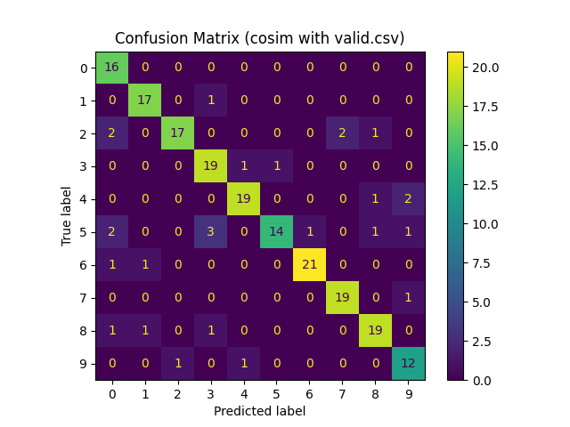
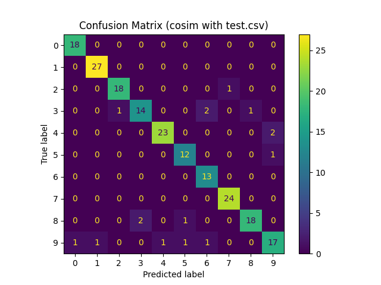

2. (4.0 points) Implement a k-nearest neighbors classifier for both Euclidean distance and
Cosine Similarity using the signature provided in starter.py. This algorithm may be
computationally intensive. To address this, you must use transform your data in some
manner (e.g., dimensionality reduction, mapping grayscale to binary, dimension scaling,
etc.) -- the exact method is up to you. This is an opportunity to be creative with feature
construction. Similarly, you are free to select your own hyper-parameters (e.g., K, the
number of observations to use, default labels, etc.). Please describe all of your design
choices and hyper-parameter selections in a paragraph. Once you are satisfied with
performance on the validation set, run your classifier on the test set and summarize results in
a 10x10 confusion matrix. Analyze your results in another paragraph.

Design Choices & Hyperparameter Selections:

K: The number of neighbors is set to 1. After used cross validation to test accuracy with different k, k = 1 had the highest accuracy, so set k = 1 for KNN.

Transformation: standardization (Z-score normalization) is used for dimension scaling. Tried PCA with different number of PC and normalization, normalization produced the best accuracy.

Distance Metrics: Both Euclidean distance and Cosine Similarity were used. For cosine similarity, it's converted into a distance measure (1 - similarity) to fit the KNN paradigm.

------------------------------------------------------

Validation Set Confusion Matrix (cosine similarity):
* Class 1 has been misclassified as 3
* Class 2 has been misclassified as 0,7,8
* Class 3 has been misclassified as 4 and 5
* Class 4 has been misclassified as 8 and 9
* Class 5 has been misclassified as 0, 3, 6, 8, 9
* Class 6 has been misclassified as 0,1
* Class 8 has been misclassified as 0,1,3.
* Class 9 has been misclassified as 2,4.
* Perfect classifications: Classes 0 seem to be perfectly classified.

Test Set Confusion Matrix (cosine similarity):
* Class 2 has been misclassified as 7
* Class 3  has been misclassified  as 2,6,and 8
* Class 4 has been misclassified as 9
* Class 5 has been misclassified as 8
* Class 8 has been misclassified  as 3 and 5
* Class 9 shows a bit of scattering across different classes indicating misclassifications.
* Perfect classifications: Classes 0, 1, 6, and 7 seem to have been perfectly classified with no misclassifications.

Validation Set Confusion Matrix (Euclidean):
* Class 1 has been misclassified as 3
* Class 2 has been misclassified as 0,7,8
* Class 3 has been misclassified as 4 and 5
* Class 4 has been misclassified as 8 and 9
* Class 5 has been misclassified as 0, 3, 6, 8, 9
* Class 6 has been misclassified as 0,1
* Class 8 has been misclassified as 0,1,3.
* Class 9 has been misclassified as 2,4.
* Perfect classifications: Classes 0 seem to be perfectly classified.

Test Set Confusion Matrix (Euclidean):
* Class 2 has been misclassified as 7
* Class 3  has been misclassified  as 2,6,and 8
* Class 4 has been misclassified as 9
* Class 5 has been misclassified as 8,9
* Class 8 has been misclassified  as 3 and 5
* Class 9 shows a bit of scattering across different classes indicating misclassifications.
* Perfect classifications: Classes 0, 1, 6, and 7 seem to have been perfectly classified with no misclassifications.

* In both Cosine similarity and Euclidean metric on the test and validation datasets for KNN, the diagonal entries show a concentration of values on the main diagonal, indicating that many of the predictions are correct.
* For Class 5 on test dataset, Euclidean perform better than Cosine similarity 
* Overall Accuracy: Considering the density along the diagonal in both matrices, the model has a relatively high accuracy for the majority of the classes.
* Consistency between Test and Validation sets: The misclassifications patterns seem somewhat consistent between the test and validation sets. This suggests that the model's behavior is consistent and not due to overfitting or other anomalies specific to one dataset.
* Misclassification Patterns: Some classes (like Class 2,4,8) show consistent misclassification patterns across both sets, hinting at inherent challenges with these classes.
* Validation vs. Test: Typically, models might perform slightly better on a test set than on a validation set due to familiarity with the data distribution. However, in this case, the model performs better on the test set, suggesting that the test data might be slightly less complex or that the model has generalized well to new data.

------------------------------------------------------
Best k = 1

with validation set
KNN Accuracy 0.86 with euclidean
KNN Accuracy 0.86 with cosim

with test set
KNN Accuracy 0.92 with euclidean
KNN Accuracy 0.92 with cosim

