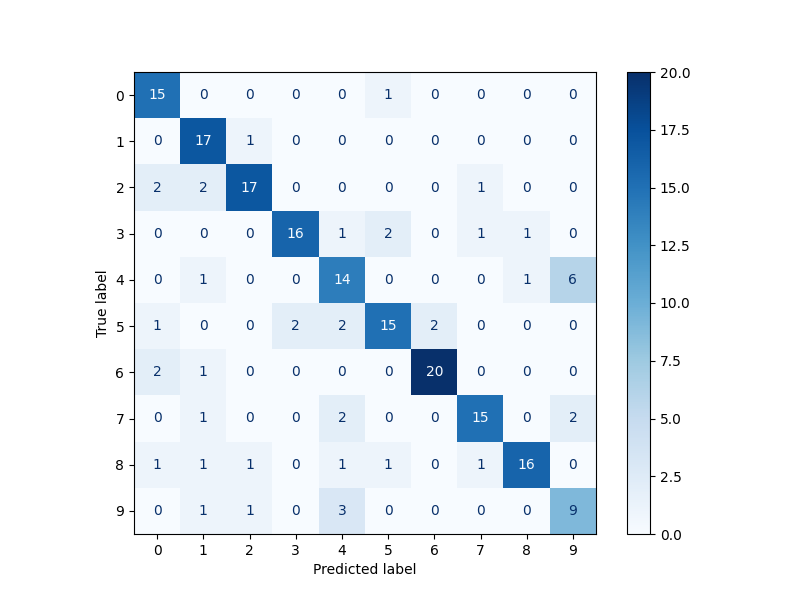
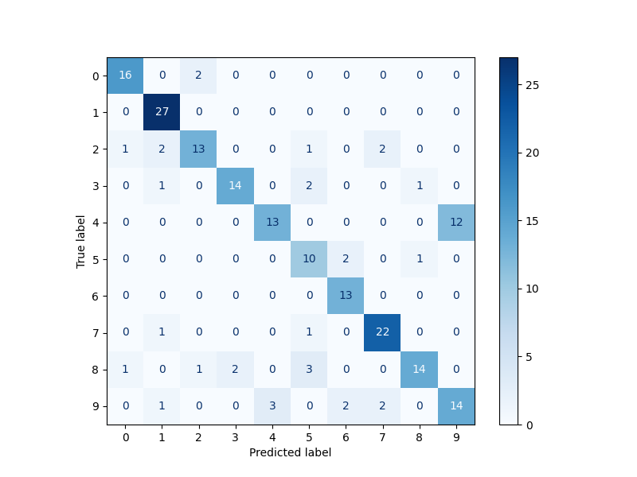
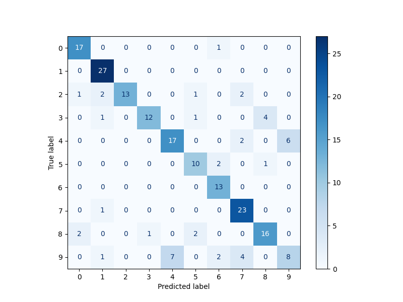

Design Choices for the k-means Classifier:**

1. **Data Normalization**: The data was normalized to ensure that the input features are on a similar scale, which ensures better clustering.

2. **t-SNE for Dimensionality Reduction**: I've chosen to apply t-SNE (t-distributed Stochastic Neighbor Embedding) to reduce the dimensionality of our data. t-SNE is a nonlinear technique, making it suitable for data where linear projections would not suffice. By reducing to 2 dimensions (as set by the `tsne_components` hyperparameter), we are also able to visualize clusters if needed.

3. **Centroid Initialization (K-means++ method)**: To provide a better starting point for clustering and to speed up convergence, I've employed the K-means++ method. This technique avoids the sometimes poor clusterings found by the standard k-means algorithm due to its initialization of centroids.

4. **Max Iterations and Tolerance**: `max_iterations` was set at 100 as a limit to avoid excessive iterations. However, to ensure that we don't go through unnecessary iterations if the centroids don't change much, a `tolerance` value was introduced. If the difference between the new and old centroids is below this value, the algorithm will stop early.

5. **Determining Cluster Label**: Once clusters are formed, the dominant label of each cluster is determined by counting the labels of the data points within it and selecting the most common one. This label is then used to predict the labels of the query data.

**Hyper-parameters**:
- `k`: Set to 41 for euclidean distance, and 31 for cosim, indicating the number of clusters. This was chosen based on validation set performance after we run the function "evaluate_kmeans_with_validation".
- `max_iterations`: Set to 100 to avoid running indefinitely.
- `tolerance`: Set to 1e-4 as a threshold to determine if the centroids are still moving significantly.
- `tsne_components`: 2 was chosen to reduce the dimensions of our data while making it potentially visualizable.

